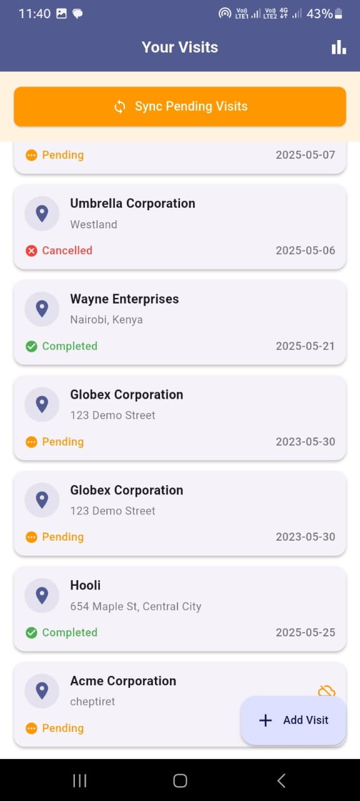
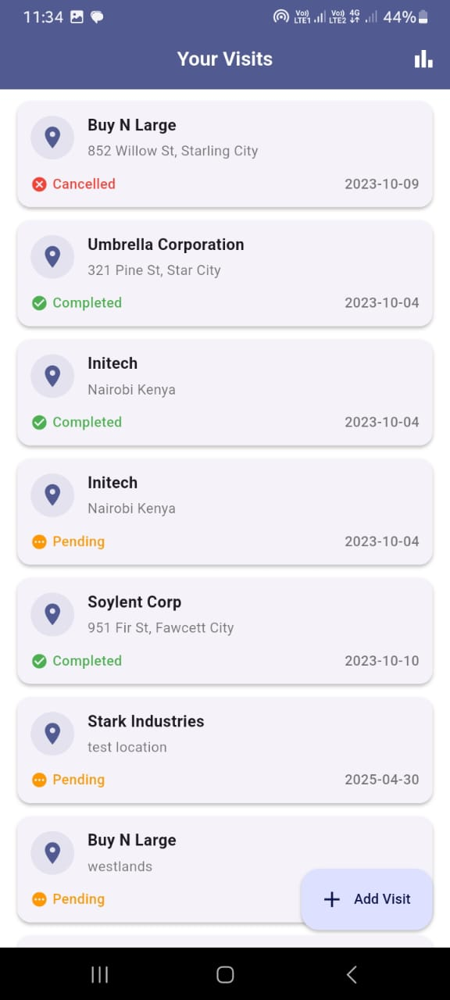
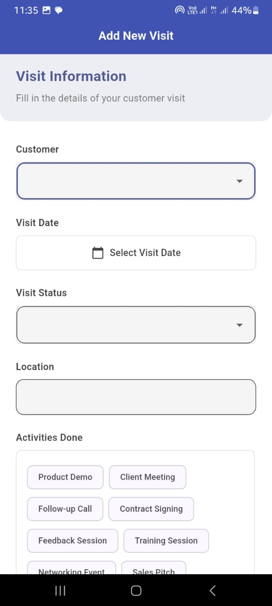
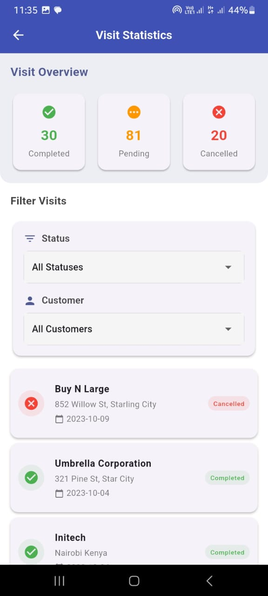
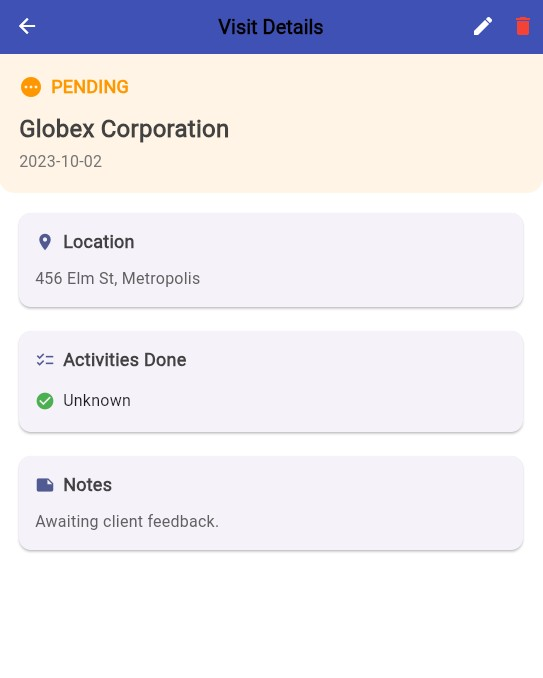

# Visit Tracker - RTM Sales Force Automation

A Flutter-based Visit Tracker feature for Route-to-Market (RTM) Sales Force Automation, implementing offline-first architecture with real-time synchronization capabilities.

## Implementation Overview

This application is a visit tracking module that allows sales representatives to:
- Record and manage customer visits
- Work seamlessly offline
- Track visit statistics and analytics
- Synchronize data when online
- Manage visit activities and status

The implementation focuses on reliability and user experience, ensuring sales representatives can continue their work regardless of network connectivity.

## Screenshots


*Visit List Screen showing offline sync indicator and visit cards*


*Visit List Screen with online status*


*Add Visit Form with modern UI and validation*


*Statistics Dashboard displaying visit analytics*


*Visit Details showing comprehensive visit information*

## Architectural Choices

### 1. Offline-First Architecture
**Choice**: Implemented an offline-first approach using Hive for local storage
**Why**: 
- Sales representatives often work in areas with poor connectivity
- Ensures uninterrupted work flow
- Provides immediate feedback to users
- Maintains data integrity during offline operations

### 2. State Management
**Choice**: Used Provider pattern for state management
**Why**:
- Lightweight and easy to implement
- Sufficient for the application's scale
- Good balance between complexity and functionality
- Easy to test and maintain

### 3. Data Synchronization
**Choice**: Implemented queue-based synchronization with Supabase
**Why**:
- Reliable data transfer when online
- Handles conflicts gracefully
- Maintains data consistency
- Provides clear sync status to users

### 4. UI/UX Design
**Choice**: Material Design with custom components
**Why**:
- Familiar interface for users
- Consistent with platform guidelines
- Responsive and adaptable
- Clear visual feedback for user actions

## Setup Instructions

1. **Prerequisites**:
   - Flutter SDK (3.0.0 or higher)
   - Dart SDK (2.17.0 or higher)
   - Android Studio / VS Code
   - Git

2. **Installation**:
   ```bash
   # Clone the repository
   git clone [repository-url]

   # Navigate to project directory
   cd visit_tracker

   # Install dependencies
   flutter pub get

   # Configure environment
   # Create .env file with Supabase credentials:
   SUPABASE_URL=your_supabase_url
   SUPABASE_KEY=your_supabase_key
   ```

3. **Run the Application**:
   ```bash
   flutter run
   ```

## Offline Support Implementation

### Local Storage
- Uses Hive for fast and efficient local data storage
- Implements a queue system for pending syncs
- Maintains data integrity during offline operations

### Synchronization
- Automatic sync when online
- Visual indicators for sync status
- Conflict resolution strategy
- Retry mechanism for failed syncs

### Testing
- Unit tests for business logic
- Widget tests for UI components
- Integration tests for critical flows
- Offline functionality tests

The test suite includes:
- Provider tests for state management
- Form validation tests
- Offline sync tests
- UI component tests
- Navigation tests

To run the tests:
```bash
# Run all tests
flutter test

# Run specific test file
flutter test test/add_visit_screen_test.dart
```

## Assumptions, Trade-offs, and Limitations

### Assumptions
1. **Data Volume**:
   - Assumes moderate number of visits per user
   - Local storage sufficient for typical usage patterns

2. **User Behavior**:
   - Users will sync data when online
   - Users understand basic offline indicators

### Trade-offs
1. **State Management**:
   - Chose Provider over more complex solutions (e.g., Bloc)
   - Simplicity over scalability for current needs

2. **Offline Storage**:
   - Hive over SQLite for simpler implementation
   - Faster development over more complex querying

3. **UI/UX**:
   - Material Design over custom design
   - Consistency over uniqueness

### Limitations
1. **Data Storage**:
   - Local storage limited by device capacity
   - No automatic cleanup of old data

2. **Synchronization**:
   - Manual sync trigger required
   - No real-time updates when offline

3. **Features**:
   - No route optimization
   - Limited analytics capabilities
   - No push notifications

## Future Improvements

1. **Technical**:
   - Implement WebSocket for real-time updates
   - Add biometric authentication
   - Implement background location tracking
   - Add push notifications

2. **Features**:
   - Customer visit history
   - Route optimization
   - Advanced analytics
   - Export functionality

## Contact

puritysang180@gmail.com

## CI/CD Implementation

The project includes a GitHub Actions workflow for continuous integration and deployment:

### Automated Workflow
- **Trigger**: Runs on push to main and pull requests
- **Checks**:
  - Code formatting verification
  - Static analysis
  - Unit and widget tests
  - APK build and artifact upload

### Benefits
- Ensures code quality
- Automates testing
- Provides build artifacts
- Streamlines development process

### How to Use
1. Push code to GitHub
2. Workflow runs automatically
3. Check Actions tab for results
4. Download APK from artifacts
